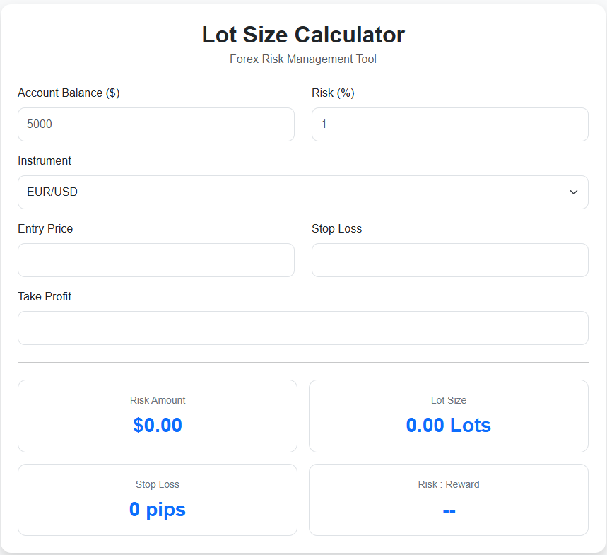

# 📈 PositionSizer

A modern, responsive Forex Position Size Calculator that helps traders calculate the correct lot size based on their account balance, risk percentage, entry price, and stop-loss level.

Built with **HTML**, **CSS**, **JavaScript**, and **Bootstrap 5**.

---

## 🌐 Live Demo

> Coming Soon (GitHub Pages)

---

## 📸 Preview

> Add a screenshot of the application here after deployment.



---

## ✨ Features

- ✅ Live position size calculation
- ✅ Instant updates as you type
- ✅ Risk amount calculation
- ✅ Stop-loss distance (Pips)
- ✅ Risk-to-Reward Ratio
- ✅ Multiple Forex pairs
- ✅ Responsive design
- ✅ Beginner-friendly interface
- ✅ No installation required

---

## 📊 Supported Instruments

| Instrument | Supported |
|------------|-----------|
| EUR/USD | ✅ |
| GBP/USD | ✅ |
| AUD/USD | ✅ |
| NZD/USD | ✅ |
| USD/CAD | ✅ |
| USD/CHF | ✅ |
| USD/JPY | ✅ |

More instruments will be added in future releases.

---

## 🧮 How It Works

The calculator determines the correct position size using:

```
Risk Amount = Account Balance × Risk %
```

```
Lot Size =
Risk Amount
──────────────────────────────
Price Difference × Contract Size
```

The application also calculates:

- Risk Amount ($)
- Stop Loss (Pips)
- Risk : Reward Ratio

---

## 🛠 Built With

- HTML5
- CSS3
- JavaScript (ES6)
- Bootstrap 5
- Git
- GitHub

---

## 📂 Project Structure

```
lot-size-calculator/
│
├── index.html
├── style.css
├── script.js
├── instruments.js
├── README.md
└── screenshot.png
```

---

## 🚀 Getting Started

Clone the repository

```bash
git clone https://github.com/TheEliteCode/lot-size-calculator.git
```

Navigate into the project

```bash
cd lot-size-calculator
```

Run with Live Server or simply open:

```
index.html
```

in your browser.

---

## 🎯 Roadmap

### Version 1.0 ✅

- Live calculations
- Lot Size
- Risk Amount
- Stop Loss (Pips)
- Risk : Reward
- Responsive UI

---

### Version 2.0 🚀

- Dark Mode
- Professional Dashboard
- Trade Summary
- Better Mobile Layout
- Animations

---

### Version 3.0 📊

- Gold (XAU/USD)
- NAS100
- US30
- BTC/USD
- Position Value
- Potential Profit
- Trade History
- Export CSV

---

### Version 4.0 📱

- Progressive Web App (PWA)
- Install on Android
- Install on iPhone
- Offline Support
- Local Storage

---

## 💡 Future Improvements

- TradingView-style interface
- Currency conversion
- Custom account currencies
- Pip value calculator
- ATR stop-loss calculator
- Multiple risk profiles
- Theme customization

---

## 🤝 Contributing

Contributions are welcome.

If you have ideas for improvements, feel free to:

- Fork the repository
- Create a feature branch
- Commit your changes
- Open a Pull Request

---

## 📜 License

This project is licensed under the MIT License.

---

## 👨‍💻 Author

### Alexander David

Data Engineer | Web Developer | Financial Technology Enthusiast

GitHub:
https://github.com/TheEliteCode

---

## ⭐ Support

If you found this project useful,

please consider giving it a ⭐ on GitHub.

It helps other developers discover the project.

---

## 📬 Feedback

Suggestions and feature requests are always welcome.

Open an Issue on GitHub and let's build something better together.